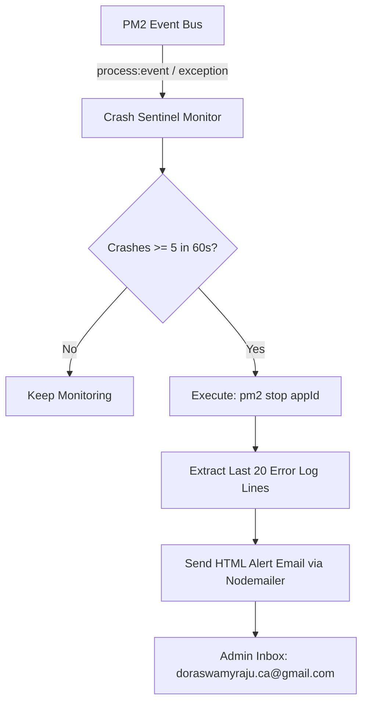

# PM2 Crash Sentinel & VPS CPU Guardrails Guide

## 📌 Overview

This document details the architecture, troubleshooting history, and implementation of the **PM2 Crash Sentinel** system on the Hostinger VPS (`147.93.107.21`), integrated into the `vps.sriddha.com` dashboard backend.

---

## 🔍 Root Cause Analysis of the 98% CPU Spike

On October 5–6, 2026, the VPS experienced a sustained **98%–100% CPU spike** caused by rapid, continuous crash-restart loops across multiple applications:

1. **`medmarg-api` (PM2 ID: 15)**:
   - **Error**: `ReferenceError: territories is not defined` inside the `app.listen()` callback in `/var/www/medmarg/backend/server.js`.
   - **Impact**: App crashed immediately on every boot, accumulating over **368,000+ restarts**.

2. **`rajugariventures` (PM2 ID: 8)**:
   - **Error**: `ReferenceError: Cannot access 'memoryTestimonialsData' before initialization` in `/var/www/rajugariventures/server.ts` (Temporal Dead Zone).
   - **Impact**: Restarted **120,000+ times**, spawning `tsx`/`esbuild` TypeScript compilations in rapid succession.

3. **Nginx Reverse Proxy Conflict**:
   - `/etc/nginx/sites-available/varaha-balaji.conf` had an extra `listen 5086;` line conflicting with `om-varaha` (port 5086).
   - When port 5086 was freed, Nginx failed to bind, briefly causing `ERR_CONNECTION_TIMED_OUT` on ports 80/443.

---

## 🛡️ The Solution: PM2 Crash Sentinel Architecture

To eliminate CPU exhaustion from endless crash loops, the **Crash Sentinel** module was added to `/var/www/vps/backend/utils/pm2CrashMonitor.js`.

### How It Works:


### 1. Automatic CPU Protection (Auto-Pause)
- Tracks crash frequency within a sliding **60-second window**.
- If any application crashes **5 times within 60 seconds**, the Sentinel immediately executes `pm2 stop <appId>`.
- **Zero Impact on Other Apps**: Only the failing application is paused; all other applications stay live.

### 2. Instant Email Alerts with Stack Trace
- Formats a real-time HTML alert card containing:
  - **App Name & PM2 ID**
  - **Server IP & Host Details**
  - **Crash Frequency in Window**
  - **Action Taken (`AUTO-PAUSED`)**
  - **The last 20 lines of the application's PM2 error log**
  - **Exact Timestamp (IST)**
- Sent via Gmail SMTP to `doraswamyraju.ca@gmail.com` and `rajugariventures@gmail.com`.

### 3. Cooldown & Safe Recovery
- A 10-minute cooldown prevents alert spamming.
- Once fixed, administrators can restart the application directly from `https://vps.sriddha.com` or via CLI (`pm2 start <appName>`).

---

## ⚙️ Configuration & Environment Variables

| Variable | Description | Default |
|---|---|---|
| `ALERT_EMAIL_USER` | Gmail account used for sending alerts | `rajugariventures@gmail.com` |
| `ALERT_EMAIL_PASS` | 16-character Google App Password | `tizr qtsh lwyl pstq` |
| `ALERT_EMAIL_TO` | Comma-separated recipient list | `doraswamyraju.ca@gmail.com, rajugariventures@gmail.com` |
| `CRASH_THRESHOLD` | Max crashes before auto-pausing | `5` |
| `CRASH_WINDOW_MS` | Time window for threshold | `60000` (60 seconds) |

---

## 🛠️ Verification & Testing

To trigger a test alert manually at any time:

```bash
node -e 'const { sendCrashAlertEmail } = require("./utils/pm2CrashMonitor"); sendCrashAlertEmail({ appName: "test-app", appId: 99, crashCount: 5, errorSnippet: "Sample verification log trace." });'
```

---

## 📋 Best Practices for Future Deployments

1. **Syntax Check before PM2 restart**:
   ```bash
   node -c /var/www/<app>/server.js
   ```
2. **Nginx Verification**:
   ```bash
   nginx -t && systemctl reload nginx
   ```
3. **Monitor first 10 seconds post-deploy**:
   ```bash
   pm2 restart <app-name>
   pm2 logs <app-name> --lines 15 --nostream
   ```
4. **Nginx Systemd Self-Healing**:
   Enabled `Restart=always` under `/etc/systemd/system/nginx.service.d/restart.conf`.
